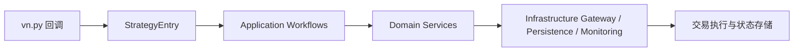

# option-trading-infra

基于 **vn.py** 的期权交易策略基础设施，定位为可直接二开的模板仓库。  
仓库内已包含策略运行主干、领域分层、配置体系、回测与测试骨架，适合作为你的期权策略项目起点。

## 项目定位

- 目标: 提供一套可运行、可测试、可扩展的期权策略工程骨架，而不是单一策略脚本
- 场景: 商品/指数期权策略开发、参数迭代、风控落地、实盘/模拟联调
- 模式: `standalone`（开发调试）与 `daemon`（守护运行）

## 核心能力

- 基于 DDD 的策略分层: `application / domain / infrastructure`
- 内置领域服务簇: `selection / risk / execution / pricing / signal / hedging / combination`
- 配置解耦: 通过 `config/*.toml` 组合策略参数与领域服务参数
- 回测入口与运行入口分离，便于研发与生产切换
- 测试覆盖面完整，包含 domain、main、web、backtesting 等模块

## 架构概览



## 目录结构

```text
config/                      配置文件（策略、领域服务、订阅、周期覆盖）
deploy/                      Docker 与部署文件
src/main/                    程序主入口与进程管理
src/strategy/application/    应用层编排
src/strategy/domain/         领域模型与领域服务
src/strategy/infrastructure/ 网关、持久化、监控等实现
src/backtesting/             回测模块
tests/                       自动化测试
doc/                         设计与操作文档
```

## 快速启动

1. 安装依赖

```bash
pip install -r requirements.txt
```

2. 启动策略（单进程）

```bash
python -m src.main.main --mode standalone --config config/strategy_config.toml
```

3. 可选：覆盖周期配置（如 15m）

```bash
python -m src.main.main --mode standalone --config config/strategy_config.toml --override-config config/timeframe/15m.toml
```

## 在 `config` 目录下配置策略（简短指引）

先在 `config/general/trading_target.toml` 定义交易标的，再在 `config/strategy_config.toml` 填写策略类和核心参数（仓位、档位、K 线窗口）。  
然后按需调整 `config/domain_service/` 下的 `selection/risk/execution/pricing` 配置；如果启用动态订阅，再配置 `config/subscription/subscription.toml`。  
需要多周期时，在 `config/timeframe/` 新增覆盖文件并通过 `--override-config` 传入。

## 以本仓库作为模板搭建自己的期权策略（聚焦领域服务）

1. 复制模板后，先明确你要改的领域模块（通常从 `src/strategy/domain/domain_service/signal` 或 `risk` 开始）。
2. 在对应 `domain_service` 子目录实现你的业务规则，保持“纯领域逻辑”，不要把 vn.py API 或 IO 细节写进服务。
3. 在 `src/strategy/strategy_entry.py` 中接入新服务（初始化与调用链），确保与现有 workflow 对齐。
4. 给新服务补一份对应的 `config/domain_service/**/*.toml`，让参数可配置。
5. 在 `tests/strategy/domain/domain_service/` 增加用例，至少覆盖正常路径、边界条件和关键风控分支。

## 运行测试

`pytest` 配置位于 `config/pytest.ini`：

```bash
pytest -c config/pytest.ini
```
